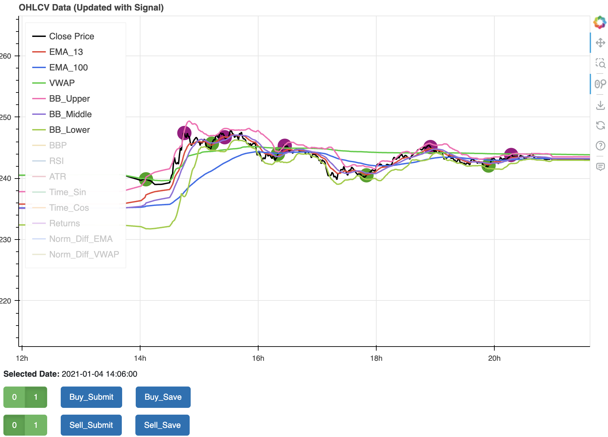

# CJBT
Python backtest application

## DF Editor
This editor was created to allow me to build out a pandas dataframe with my personal Buy and Sell signals. The resulting dataframe is then used as input for an LSTM for training on my signals for future trades. 

- data from CSV
- Insert Indicator data
- Display chart
- Select Buy/Sell points
- Submit to place into df
- Save edits to pickle file

